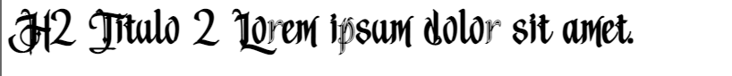
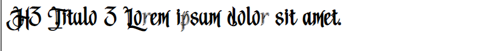

# CSS

- [Declaracion de Classes](#declaracion-de-classes)
- [Clases Estandar](#clases-estandar)
- [Estilos de Tags](#estilos-de-tags)
    - [Botnoes](#botnoes)

## Declaracion de Classes

`{TAG}[_{Tipo}]_{Descriptcion-breve}`

### Ejemplos:

`DIV_MarginTop`

`INP_Texto_PaddingLeft`

`P_After_Linea-alineada`

## Clases Estandar

***.titulo1***
~~~
h1,.titulo1{
    font-family: 'Medieval';
    font-size: 60px;
}
~~~

---

***.titulo2***
~~~
h2,.titulo2{
    font-family: 'Medieval';
    font-size: 50px;
}
~~~

---

***.titulo3***
~~~
h3,.titulo3{
    font-family: 'Medieval';
    font-size: 40px;
}
~~~

---

***.texto_normal***
~~~
p,.texto_normal{
    font-family: 'MedievalSharp';
    font-size: 20px;
}
~~~

---

***.amarillo |  .naranga |  .marron |  .rojo |  .rojo_oscuro***
~~~
.amarillo{
    color:var(--amarillo);      /* rgb(242,230,53) */
}

.naranga{
    color:var(--naranga);       /* rgb(242,171,39) */
}

.marron{
    color:var(--marron);        /* rgb(217,141,48) */
}

.rojo{
    color:var(--rojo);          /* rgb(217,54,54) */
}

.rojo_oscuro{
    color:var(--rojo-oscuro);   /* rgb(166,51,51) */
}
~~~

---

## Estilos de Tags

### Botnoes

Hay 3 tamaños de botones y 2 estilos por cada tamaño:

Si es solo un boton con texto se usara la siguiente case: BTN_NoA_{ST1|ST2}_{Pequeño|Mediano|Grande}

Si es solo un boyon con un a dentro se usara la siguiente case: BTN_A_{ST1|ST2}_{Pequeño|Mediano|Grande}

Ejemplo:
~~~
<button class="BTN_NoA_ST1_Pequeño">Boton Pequeño Estilo 1</button>

<button class="BTN_A_ST1_Pequeño"><a href="">Boton Pequeño con a Estilo 1</a><button>
~~~
