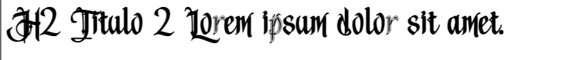
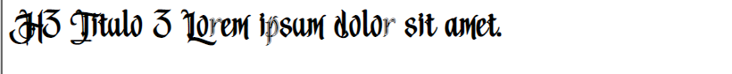

# CSS

## Declaracion de Classes

`{TAG}[_{Tipo}]_{Descriptcion-breve}`

### Ejemplos:

`DIV_MarginTop`

`INP_Texto_PaddingLeft`

`P_After_Linea-alineada`

## Clases Estandar

***.titulo1***
~~~
h1,.titulo1{
    font-family: 'Medieval';
    font-size: 60px;
}
~~~

---

***.titulo2***
~~~
h2,.titulo2{
    font-family: 'Medieval';
    font-size: 50px;
}
~~~

---

***.titulo3***
~~~
h3,.titulo3{
    font-family: 'Medieval';
    font-size: 40px;
}
~~~

---

***.texto_normal***
~~~
p,.texto_normal{
    font-family: 'MedievalSharp';
    font-size: 20px;
}
~~~

---
